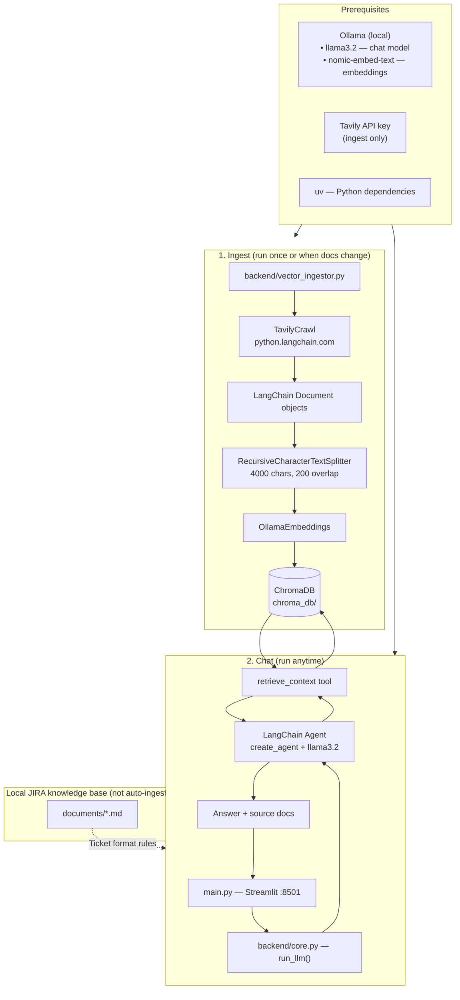
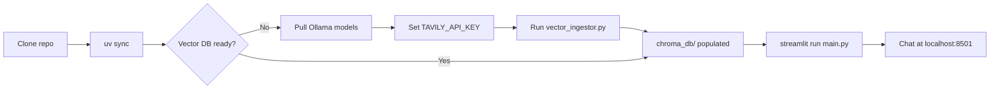
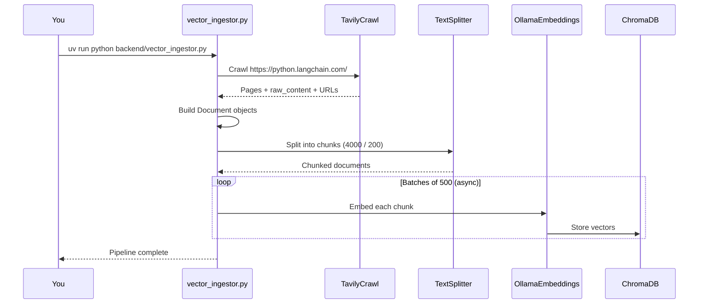
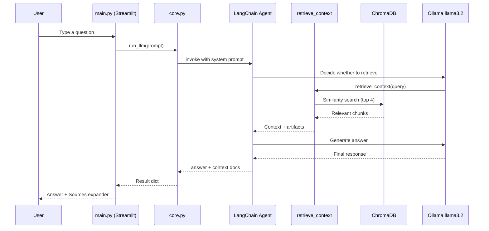

# JIRA Ticket Generator — LangChain RAG Bot

An AI assistant that turns informal feature requests into structured JIRA tickets. It uses **Retrieval-Augmented Generation (RAG)** with a LangChain agent, local Ollama models, ChromaDB, and a Streamlit chat UI.

The app retrieves guidance from indexed documentation, answers questions in chat, and is designed to produce JIRA-ready output (title, description, acceptance criteria, time estimates, and suggested code changes).

---

## Table of contents

- [Overview](#overview)
- [Architecture](#architecture)
- [Prerequisites](#prerequisites)
- [Installation](#installation)
- [Configuration](#configuration)
- [Document ingestion](#document-ingestion)
- [Running the chat UI](#running-the-chat-ui)
- [Using the chat](#using-the-chat)
- [Project structure](#project-structure)
- [Knowledge base documents](#knowledge-base-documents)
- [Troubleshooting](#troubleshooting)
- [Tech stack](#tech-stack)

---

## Overview

This project has two main workflows:

1. **Ingest** — Crawl documentation, split it into chunks, embed them with Ollama, and store vectors in ChromaDB (`chroma_db/`).
2. **Chat** — Ask questions in Streamlit; a LangChain agent retrieves relevant chunks and generates an answer with cited sources.

The Streamlit UI is titled **“Bot generator of JIRA tickets”**. Local markdown guides under `documents/` define how tickets should be formatted. The ingest pipeline currently indexes **LangChain documentation** from [python.langchain.com](https://python.langchain.com/) (via Tavily). You can extend the ingestor later to index the JIRA guides in `documents/` as well.

---

## Architecture

### High-level flow



### Quick start flow



### Ingest sequence



### Chat / RAG sequence



---

## Prerequisites

| Requirement | Purpose |
|-------------|---------|
| **Python 3.12+** | Runtime (see `.python-version`) |
| **[uv](https://docs.astral.sh/uv/)** | Dependency management (recommended) |
| **[Ollama](https://ollama.com/)** | Local LLM and embeddings |
| **Tavily API key** | Web crawl during document ingestion |
| **Git** | Clone and version control |

Basic familiarity with Python, virtual environments, and environment variables is expected.

---

## Installation

### 1. Clone the repository

```bash
git clone https://github.com/emarco177/langchain-course
cd langchain-course
```

### 2. Install Python dependencies

```bash
uv sync
```

This reads `pyproject.toml` and installs LangChain, Streamlit, Chroma, Tavily, Ollama integrations, and related packages.

### 3. Install and start Ollama

Install Ollama from [ollama.com](https://ollama.com/), then pull the models used by this project:

```bash
ollama pull llama3.2
ollama pull nomic-embed-text
```

Ensure the Ollama server is running before ingest or chat:

```bash
ollama serve
```

### 4. Configure environment variables

Create a `.env` file in the project root:

```bash
# Required for document ingestion (Tavily crawl)
TAVILY_API_KEY=your_tavily_api_key_here
```

Get a Tavily API key at [tavily.com](https://tavily.com/).

The chat flow uses Ollama locally and does not require an OpenAI or cloud LLM key unless you change the model configuration in `backend/core.py`.

---

## Configuration

| Setting | Location | Default |
|---------|----------|---------|
| Chat model | `backend/core.py` | `llama3.2` via Ollama |
| Embedding model | `backend/core.py`, `backend/vector_ingestor.py` | `nomic-embed-text` |
| Vector store path | `backend/core.py`, `backend/vector_ingestor.py` | `chroma_db/` |
| Retrieval count | `backend/core.py` | Top 4 chunks (`k=4`) |
| Streamlit theme / port | `.streamlit/config.toml` | Dark theme, port `8501` |
| Crawl target | `backend/vector_ingestor.py` | `https://python.langchain.com/` |
| Chunk size / overlap | `backend/vector_ingestor.py` | `4000` / `200` |

---

## Document ingestion

Ingestion builds the vector database the chat agent searches. **Run this before using chat** (or whenever you want to refresh indexed docs).

```bash
uv run python backend/vector_ingestor.py
```

### What happens during ingest

1. **Crawl** — `TavilyCrawl` fetches pages from the LangChain Python docs site (`max_depth=2`, advanced extraction).
2. **Convert** — Each page becomes a LangChain `Document` with `metadata.source` set to the page URL.
3. **Chunk** — `RecursiveCharacterTextSplitter` splits documents into ~4000-character chunks with 200-character overlap.
4. **Embed** — `OllamaEmbeddings` (`nomic-embed-text`) vectorizes each chunk.
5. **Store** — Vectors are written to ChromaDB under `chroma_db/` in batches of 500 (async).

### When to re-run ingest

- First-time setup
- After deleting or corrupting `chroma_db/`
- When you change the crawl URL, chunk settings, or embedding model
- When you modify the ingestor to index local `documents/` files

---

## Running the chat UI

After ingestion completes and Ollama is running:

```bash
uv run streamlit run main.py
```

Open the app at [http://localhost:8501](http://localhost:8501).

### Test the RAG pipeline from the CLI

You can also invoke the agent directly without Streamlit:

```bash
uv run python backend/core.py
```

This runs a sample query (`"what are deep agents?"`) and prints the result.

---

## Using the chat

1. Open the Streamlit app in your browser.
2. Type a prompt in the chat input at the bottom.
3. Wait while the app retrieves documents and generates a response.
4. Read the assistant reply; expand **Sources** to see which URLs or files were used.
5. Use **Clear chat** in the sidebar to reset the conversation.

### Example prompts for JIRA ticket generation

Provide structured inputs similar to the schema in `documents/jira-ticket-input-output-schema.md`:

```
Ticket name: Create a login page
Description: I want a login page with HTML, CSS, and JavaScript.
Project URL: /Users/you/projects/login_page
Assigned to: Your Name
```

The assistant uses retrieved context plus your prompt to produce ticket fields (title, description, time estimate, acceptance criteria, suggested changes).

### Session behavior

- Message history is kept in Streamlit `session_state` until you click **Clear chat**.
- Errors during generation are shown inline with exception details.
- Each assistant message may include a **Sources** expander listing document paths or URLs from retrieval metadata.

---

## Project structure

```
langchain-course/
├── main.py                      # Streamlit chat UI
├── backend/
│   ├── core.py                  # RAG agent, retrieve_context tool, run_llm()
│   └── vector_ingestor.py       # Crawl → chunk → embed → Chroma pipeline
├── documents/                   # JIRA ticket knowledge base (local markdown)
│   ├── jira-ticket-generator-overview.md
│   ├── jira-ticket-input-output-schema.md
│   ├── jira-ticket-acceptance-criteria-guide.md
│   ├── jira-ticket-time-estimation-guide.md
│   ├── jira-ticket-suggested-changes-guide.md
│   └── examples/
│       └── example-01-login-page.md
├── chroma_db/                   # Persistent Chroma vector store (created by ingest)
├── .streamlit/
│   └── config.toml              # Streamlit theme and server settings
├── pyproject.toml               # Project metadata and dependencies
├── uv.lock                      # Locked dependency versions
└── .env                         # Environment variables (create locally, not committed)
```

---

## Knowledge base documents

The `documents/` folder defines how the bot should format JIRA tickets:

| File | Contents |
|------|----------|
| `jira-ticket-generator-overview.md` | Purpose, workflow, scope, and principles |
| `jira-ticket-input-output-schema.md` | Required inputs and output fields |
| `jira-ticket-acceptance-criteria-guide.md` | Writing testable acceptance criteria |
| `jira-ticket-time-estimation-guide.md` | Time / story-point estimation rules |
| `jira-ticket-suggested-changes-guide.md` | Rules for file-specific code suggestions |
| `examples/example-01-login-page.md` | Full input → output example |

These files are the intended ticket-generation knowledge base. To use them in RAG retrieval, extend `vector_ingestor.py` to load and index local markdown in addition to (or instead of) the LangChain docs crawl.

---

## Troubleshooting

| Problem | Likely cause | Fix |
|---------|--------------|-----|
| Empty or weak answers | `chroma_db/` not populated | Run `uv run python backend/vector_ingestor.py` |
| Connection error to Ollama | Ollama not running or models missing | Run `ollama serve` and pull `llama3.2` + `nomic-embed-text` |
| Tavily / crawl errors | Missing or invalid API key | Set `TAVILY_API_KEY` in `.env` |
| `ModuleNotFoundError: logger` | `logger.py` not present | Add a `logger` module or replace logging imports in `vector_ingestor.py` |
| Port already in use | Another Streamlit instance on 8501 | Stop the other process or change `serverPort` in `.streamlit/config.toml` |
| SSL errors during crawl | Certificate issues | The ingestor configures certifi paths automatically; ensure certifi is installed via `uv sync` |


